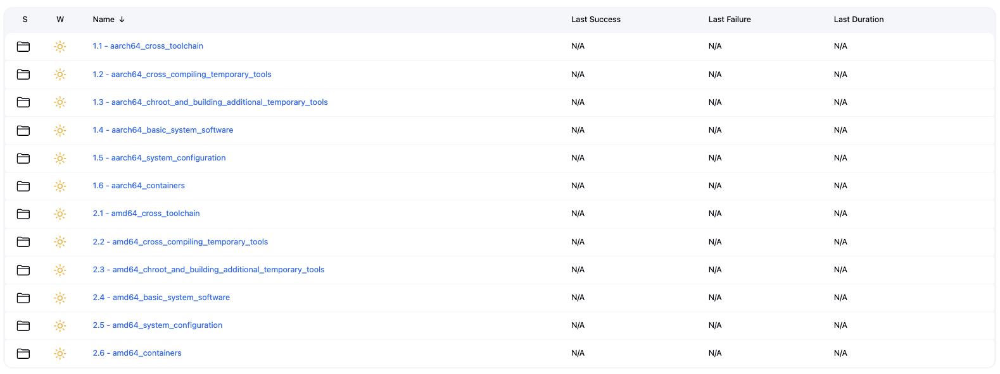

# gDT - Generic Distro Toolk1t

[](https://opensource.org/licenses/Apache-2.0)


## Project Overview

I’m building GNU/Linux following LFS (Linux From Scratch) with Ansible and Jenkins. This project is a general-purpose framework for building Linux distributions in a semi-automated and DevOps way.

gDT (Generic Distro Toolkit) is a work-in-progress.

### Step 0 - Install required tools

#### LFS Build Server

* Jenkins
* Redmine
* Enable KVM
* Libvirt, QEMU
* Cockpit
* Redmine (if you want track your progress)

#### LFS Numbered Folders (follow the order)

Ensure you follow the sequence of numbered folders during the LFS build process. Each folder corresponds to a specific step, and skipping or rearranging them may lead to errors or inconsistencies in the build.




#### LFS Build Node aarch64

```bash
[foobar@homer]:~/WORK/Generic-Distro-ToolK1t $ vagrant provision
==> ubuntu-arm-lfs: Running provisioner: ansible...
    ubuntu-arm-lfs: Running ansible-playbook...

PLAY [Print node name] *********************************************************

TASK [Gathering Facts] *********************************************************
ok: [ubuntu-arm-lfs]

TASK [Display the node name] ***************************************************
ok: [ubuntu-arm-lfs] => {
    "msg": "Node name: ubuntu-arm-lfs"
}
...
```

### Step 1 - Provision an aarch64 build node

```bash
[eugenio@MacBook-Pro-di-Eugenio-2.fritz.box]:~/WORK/Generic-Distro-ToolK1t $ vagrant provision
==> ubuntu-arm-lfs: Running provisioner: ansible...
    ubuntu-arm-lfs: Running ansible-playbook...

PLAY [Print node name] *********************************************************

TASK [Gathering Facts] *********************************************************
ok: [ubuntu-arm-lfs]

TASK [Display the node name] ***************************************************
ok: [ubuntu-arm-lfs] => {
    "msg": "Node name: ubuntu-arm-lfs"
}
```

### Step 2 - Create Jenkins Folder

```bash

ubuntu@ns3137793:~/gdt$ bash start.sh 

=========================================
 Welcome to the Generic Distro Toolkit! 
=========================================

Inventory file found. Proceeding...

Select an option:
0)  Create Jenkins Folders
1)  Build AMD64 all Jenkins Jobs
2)  Build AMD64 cross_toolchain Jenkins Jobs
3)  Build AMD64 cross_compiling_temporary_tools Jenkins Jobs
4)  Build AMD64 chroot_and_building_additional_temporary_tools Jenkins Jobs
5)  Build AMD64 basic_system_software Jenkins Jobs
6)  Build AMD64 system_configuration Jenkins Jobs
7)  Build AMD64 containers Jenkins Jobs
8)  Build AARCH64 all Jenkins Jobs
9)  Build AARCH64 cross_toolchain Jenkins Jobs
10) Build AARCH64 cross_compiling_temporary_tools Jenkins Jobs
11) Build AARCH64 chroot_and_building_additional_temporary_tools Jenkins Jobs
12) Build AARCH64 basic_system_software Jenkins Jobs
13) Build AARCH64 system_configuration Jenkins Jobs
14) Build AARCH64 containers Jenkins Jobs
15) Exit

Enter your choice: 0
Building Jenkins Folders...

PLAY [Create GNU/Linux GDT (Garanti Del Talento)] **********************************************************************************************************************************************************************************************************************

TASK [Gathering Facts] *************************************************************************************************************************************************************************************************************************************************
ok: [localhost]

TASK [ansible-gdt : Include aarch64_jobs.yml tasks] ********************************************************************************************************************************************************************************************************************
included: /home/ubuntu/gdt/jenkins-lfs/playbooks/roles/ansible-gdt/tasks/aarch64_jobs.yml for localhost

TASK [ansible-gdt : Create Jenkins Folder (aarch64)] *******************************************************************************************************************************************************************************************************************
ok: [localhost] => (item=aarch64_cross_toolchain)
ok: [localhost] => (item=aarch64_cross_compiling_temporary_tools)
ok: [localhost] => (item=aarch64_chroot_and_building_additional_temporary_tools)
ok: [localhost] => (item=aarch64_basic_system_software)
ok: [localhost] => (item=aarch64_system_configuration)
ok: [localhost] => (item=aarch64_containers)

TASK [ansible-gdt : Include amd64_jobs.yml tasks] **********************************************************************************************************************************************************************************************************************
included: /home/ubuntu/gdt/jenkins-lfs/playbooks/roles/ansible-gdt/tasks/amd64_jobs.yml for localhost

TASK [ansible-gdt : Create Jenkins Folder (amd64)] *********************************************************************************************************************************************************************************************************************
ok: [localhost] => (item=amd64_cross_toolchain)
ok: [localhost] => (item=amd64_cross_compiling_temporary_tools)
ok: [localhost] => (item=amd64_chroot_and_building_additional_temporary_tools)
ok: [localhost] => (item=amd64_basic_system_software)
ok: [localhost] => (item=amd64_system_configuration)
ok: [localhost] => (item=amd64_containers)

PLAY RECAP *************************************************************************************************************************************************************************************************************************************************************
localhost                  : ok=5    changed=0    unreachable=0    failed=0    skipped=0    rescued=0    ignored=0   
```

### Project Structure

```bash
Generic-Distro-ToolK1t/
├── jenkins-lfs/              # LFS build automation
│   ├── playbooks/            # Ansible playbooks for system setup
│       └── roles/
│           └── ansible-gdt/  # Main GDT Ansible role
│ 
├── service-manager/         # Go-based service management tool
│   ├── main.go              # Terminal UI service manager
│   ├── go.mod               # Go module dependencies
│   └── README.md            # Service manager documentation
├── images/                  # Screenshots and documentation images
└── Vagrantfile              # Development environment setup
```
