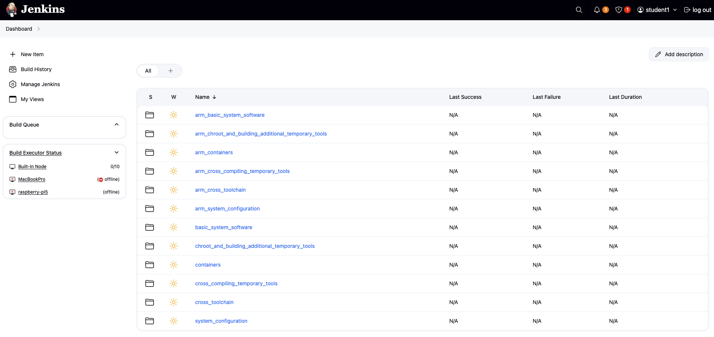
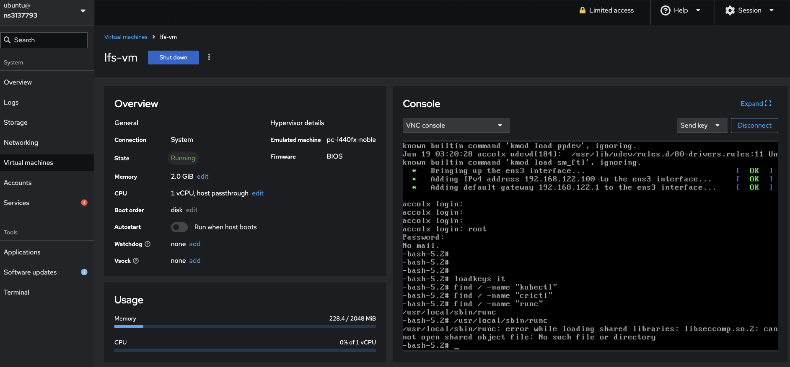
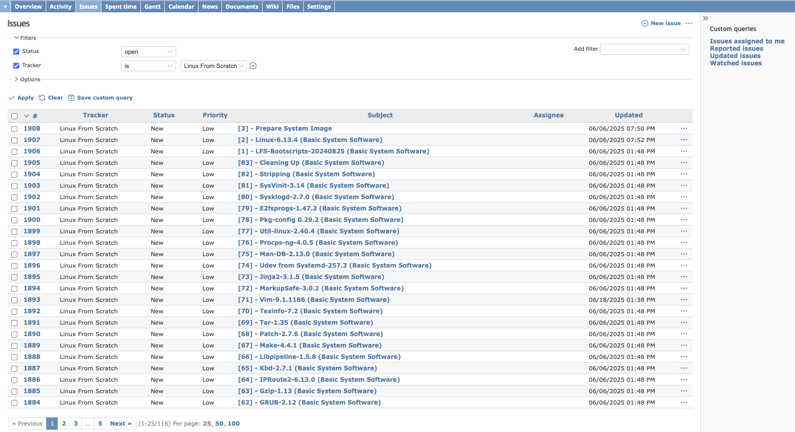

# GDT (Generic Distro Toolkit)

## Description
The Generic Distro Toolkit (GDT) is part of the Garanti Del Talento initiative. It facilitates the creation of a custom GNU/Linux distribution based on Linux From Scratch (LFS) ([LFS website](https://www.linuxfromscratch.org/)) by using Ansible and Jenkins.

### Toolkit as Jenkins Jobs


### Cockpit for Testing the OS Image


### Redmine Issues for tracking


## Usage

### Create Jenkins Job via Ansible

Run the following command to create a Jenkins job using Ansible:

```bash
ansible-playbook -i inventories/hosts.ini playbooks/start.yml 
```

### Generate Redmine Issues for Tools Compilation

To generate Redmine issues for each tool that needs to be compiled, run:

```bash
cd playbooks/roles/ansible-gdt/vars
python3 redmine.py
```

### LFS Steps and Additional Configurations

Each step of the LFS process, along with extra configurations, is defined in the following file:  
[main.yml on GitHub](https://github.com/lucky-sideburn/gdt/blob/main/jenkins-lfs/playbooks/roles/ansible-gdt/vars/main.yml)