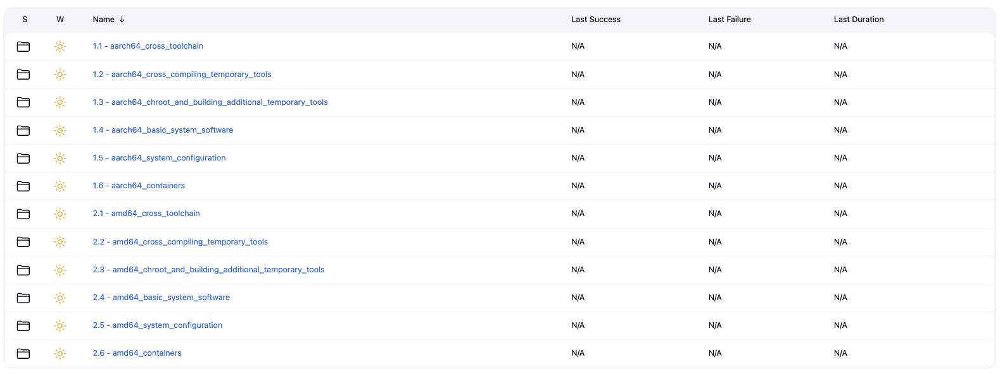

# Generic Distro Toolkit for GNU/Linux
## Another approach to ALFS (Automated Linux From Scratch)
[https://devopstribe.it/2025/08/18/my-journey-in-building-a-gnu-linux-aarch64-arm-system/
](https://devopstribe.it/2025/08/18/my-journey-in-building-a-gnu-linux-aarch64-arm-system/)


[](https://opensource.org/licenses/Apache-2.0)

## Project Overview

I’m building GNU/Linux following LFS (Linux From Scratch) with Ansible and Jenkins. This project is a general-purpose framework for building Linux distributions in a semi-automated and DevOps way.

gdt (Generic Distro Toolkit) is a work-in-progress.

### Project Structure

```bash
Generic-Distro-ToolK1t/
├── jenkins-lfs/               # LFS build automation
│   └── start.sh               # Bash script to handle most tasks, especially build jobs for different architectures and LFS sections
│   └── chroot_in.sh           # Structured command wrapper to enter chroot
│   └── playbooks/             # Ansible playbooks for system setup
│       └── roles/
│       │    └── ansible-gdt/  # Main GDT Ansible role
│       │        └── tasks/          # Contains aarch64_jobs and amd64_jobs (Jenkins job creation) and system_conf (generic configuration for both architectures)
│       │        └── vars/main.yaml  # Defines all Jenkins jobs, package build instructions, and configuration tasks
│       │        └── files/          # Static files (OS configs, init scripts, bash scripts, kernel configs)
│       └── aarch64_lfs.yml    # Configure the aarch64 build node (also acts as Jenkins slave)
│       └── reset_jobs.yml     # Remove all Jenkins jobs
│       └── starts.yml         # Launch ansible-gdt role (start.sh injects tags to start specific tasks)
├── images/                    # Screenshots and documentation assets
├── os_images/                 # Vagrant-synced folder containing *.img files (aarch64)
└── Vagrantfile                # Defines the aarch64 build node (amd64 builds run directly on Jenkins master for now)
```

# Prerequisites

* Before starting the operating system build, ensure you have a Jenkins server to coordinate the agent.
* For building AMD64 or AARCH64, enable KVM and install libvirt, QEMU, and Cockpit.

Notes:  
* For AMD64, I used a physical server with both the Jenkins Master and Agent running on the same node.  
* For AARCH64, I used my laptop with a VM acting as the Jenkins Agent, connected to a Jenkins Master (you can provision the master wherever you prefer).  

### Build AMD64 - GNU/Linux Operating System

1. Clone this repo
2. Run `start.sh`, go to *Infrastructure*, then select *3) Provision AMD64 build node (Ansible)*
3. Run `start.sh` and select *1) Jenkins Setup (create folders)*
4. Run `start.sh`, select *2) AMD64 Jobs*, then choose one of the following:
```bash
  0) All AMD64 Jobs
  1) cross_toolchain
  2) cross_compiling_temporary_tools
  3) chroot_and_building_additional_temporary_tools
  4) basic_system_software
  5) system_configuration
  6) containers
  7) GenAI
  8) Systemd Integration
```
5. Run Jenkins jobs in the order of the numbered folders and jobs.
6. The job *0004 - Prepare System Image (System Configuration)* will start the VMs, which can be monitored using Cockpit.


### Build AARCH64 - GNU/Linux Operating System

1. Clone this repo
2. Run `start.sh`, go to *Infrastructure*, then select *2) Provision AARCH64 build node (Vagrant)*
3. Run `start.sh` and select *1) Jenkins Setup (create folders)*
4. Run `start.sh`, select *3) AARCH64 Jobs*, then choose one of the following:
```bash
  0) All AARCH64 Jobs
  1) cross_toolchain
  2) cross_compiling_temporary_tools
  3) chroot_and_building_additional_temporary_tools
  4) basic_system_software
  5) system_configuration
  6) containers
  7) GenAI
  8) Systemd Integration
```
5. Run Jenkins jobs in the order of the numbered folders and jobs.
6. Run `start.sh`, go to *Infrastructure*, and select *1) Start AARCH64 VM on QEMU* to work on your GNU/Linux system.

### EL9 Package Map for Jenkins Build Inputs

Use `start.sh` -> *Infrastructure* -> *6) Create EL9 packages map (Rocky/libvirt)*.

This action will:

1. Start `rocky9-lfs` using `VAGRANT_DEFAULT_PROVIDER=libvirt vagrant up rocky9-lfs --no-provision`
2. Provision `rocky9-lfs` with Ansible (`jenkins-lfs/playbooks/el9_pkgs.yml`)
3. Upgrade all packages in the Rocky Linux 9 system
4. Export parse-friendly package maps into:
  - `jenkins-lfs/package_maps/el9_pkgs.tsv`
  - `jenkins-lfs/package_maps/el9_pkgs.json`

The generated map is intended to be versioned in git and used by Jenkins jobs to decide which upstream package versions should be built.

### Jenkins Job Sync Mode (Upsert)

Jenkins job definitions are managed in upsert mode:

- Update existing job config when the job already exists.
- Create the job only when it does not exist yet.

In practice, this prevents stale job configuration and ensures changes in Ansible templates are applied to existing Jenkins jobs.

### LFS Numbered Job Jenkins

The operating system can be built by following Jenkins numbered builds.

Default root password is password.123

```bash
   - name: 0001 - Binutils Pass 1 (Cross Toolchain)
    - name: 0002 - GCC Pass 1 (Cross Toolchain)
    - name: 0003 - Linux API Headers (Cross Toolchain)
    - name: 0004 - Glibc (Cross Toolchain)
    - name: 0005 - Libstdc++ from GCC  (Cross Toolchain)
    - name: 0001 - M4 (Cross Compiling Temporary Tools)
    - name: 0002 - Ncurses (Cross Compiling Temporary Tools)
    - name: 0003 - Bash (Cross Compiling Temporary Tools)
    - name: 0004 - Coreutils (Cross Compiling Temporary Tools)
    - name: 0005 - Diffutils (Cross Compiling Temporary Tools)
    - name: 0006 - File (Cross Compiling Temporary Tools)
    - name: 0007 - Findutils (Cross Compiling Temporary Tools)
    - name: 0008 - Gawk (Cross Compiling Temporary Tools)
    - name: 0009 - Grep (Cross Compiling Temporary Tools)
    - name: 0010 - Gzip (Cross Compiling Temporary Tools)
    - name: 0011 - Make (Cross Compiling Temporary Tools)
    - name: 0012 - Patch (Cross Compiling Temporary Tools)
    - name: 0013 - Sed (Cross Compiling Temporary Tools)
    - name: 0014 - Tar (Cross Compiling Temporary Tools)
    - name: 0015 - Xz (Cross Compiling Temporary Tools)
    - name: 0016 - Binutils (Cross Compiling Temporary Tools)
    - name: 0017 - GCC Pass 2 (Cross Compiling Temporary Tools)
    - name: 0001 - Changing Ownership and Preparing Virtual Kernel File Systems (Chroot and Building Additional Temporary Tools)
    - name: 0002 - Gettext (Chroot and Building Additional Temporary Tools)
    - name: 0003 - Bison (Chroot and Building Additional Temporary Tools)
    - name: 0004 - Perl (Chroot and Building Additional Temporary Tools)
    - name: 0005 - Python (Chroot and Building Additional Temporary Tools)
    - name: 0006 - Texinfo (Chroot and Building Additional Temporary Tools)
    - name: 0007 - Util-linux (Chroot and Building Additional Temporary Tools)
    - name: 0008 - Cleaning up and Saving the Temporary System (Chroot and Building Additional Temporary Tools)
    - name: 0001 - Man-pages (Basic System Software)
    - name: 0002 - Iana-Etc (Basic System Software)
    - name: 0003 - Glibc (Basic System Software)
    - name: 0004 - Zlib (Basic System Software)
    - name: 0005 - Bzip2 (Basic System Software)
    - name: 0006 - Xz (Basic System Software)
    - name: 0007 - Lz4 (Basic System Software)
    - name: 0008 - Zstd (Basic System Software)
    - name: 0009 - File (Basic System Software)
    - name: 0010 - Readline (Basic System Software)
    - name: 0011 - M4 (Basic System Software)
    - name: 0012 - Bc (Basic System Software)
    - name: 0013 - Flex (Basic System Software)
    - name: 0014 - Tcl (Basic System Software)
    - name: 0015 - Expect (Basic System Software)
    - name: 0016 - DejaGNU (Basic System Software)
    - name: 0017 - Pkgconf (Basic System Software)
    - name: 0017A - pkg-config (Basic System Software)
    - name: 0018 - Binutils (Basic System Software)
    - name: 0019 - GMP (Basic System Software)
    - name: 0020 - MPFR (Basic System Software)
    - name: 0021 - MPC (Basic System Software)
    - name: 0022 - Attr (Basic System Software)
    - name: 0023 - Acl (Basic System Software)
    - name: 0024 - Libcap (Basic System Software)
    - name: 0025 - Libxcrypt-4.4.38 (Basic System Software)
    - name: 0026 - Shadow (Basic System Software)
    - name: 0027 - GCC (Basic System Software)
    - name: 0028 - Ncurses (Basic System Software)
    - name: 0029 - Sed (Basic System Software)
    - name: 0030 - Psmisc (Basic System Software)
    - name: 0031 - Gettext (Basic System Software)
    - name: 0032 - Bison (Basic System Software)
    - name: 0033 - Grep (Basic System Software)
    - name: 0034 - Bash-5.2.37 (Basic System Software)
    - name: 0035 - Libtool (Basic System Software)
    - name: 0036 - GDBM (Basic System Software)
    - name: 0037 - Gperf (Basic System Software)
    - name: 0038 - Expat (Basic System Software)
    - name: 0039 - Inetutils (Basic System Software)
    - name: 0040 - Less (Basic System Software)
    - name: 0041 - Perl (Basic System Software)
    - name: 0042 - XML Parser (Basic System Software)
    - name: 0043 - Intltool (Basic System Software)
    - name: 0044 - Autoconf (Basic System Software)
    - name: 0045 - Automake (Basic System Software)
    - name: 0046 - OpenSSL (Basic System Software)
    - name: 0047 - Libelf (Basic System Software)
    - name: 0048 - Libffi (Basic System Software)
    - name: 0049 - Python (Basic System Software)
    - name: 0050 - Flit-Core (Basic System Software)
    - name: 0051 - Wheel (Basic System Software)
    - name: 0052 - Setuptools (Basic System Software)
    - name: 0053 - Ninja (Basic System Software)
    - name: 0054 - Meson (Basic System Software)
    - name: 0055 - Kmod (Basic System Software)
    - name: 0056 - Coreutils (Basic System Software)
    - name: 0057 - Check (Basic System Software)
    - name: 0058 - Diffutils (Basic System Software)
    - name: 0059 - Gawk (Basic System Software)
    - name: 0060 - Findutils (Basic System Software)
    - name: 0061 - Groff (Basic System Software)
    - name: 0062 - GRUB (Basic System Software)
    - name: 0063 - Gzip (Basic System Software)
    - name: 0064 - IPRoute2 (Basic System Software)
    - name: 0065 - Kbd (Basic System Software)
    - name: 0066 - Libpipeline (Basic System Software)
    - name: 0067 - Make (Basic System Software)
    - name: 0068 - Patch (Basic System Software)
    - name: 0069 - Tar (Basic System Software)
    - name: 0070 - Texinfo (Basic System Software)
    - name: 0071 - Vim (Basic System Software)
    - name: 0072 - MarkupSafe (Basic System Software)
    - name: 0073 - Jinja2 (Basic System Software)
    - name: 0074 - Udev from Systemd (Basic System Software)
    - name: 0075 - Man-DB (Basic System Software)
    - name: 0076 - Procps-ng (Basic System Software)
    - name: 0077 - Util-linux (Basic System Software)
    - name: 0078 - E2fsprogs (Basic System Software)
    - name: 0079 - Sysklogd (Basic System Software)
    - name: 0080 - SysVinit (Basic System Software)
    - name: 0081 - openssh (Basic System Software)
    - name: 0082 - Stripping (Basic System Software)
    - name: 0083 - Cleaning Up (Basic System Software)
    - name: 0084 - libgcrypt (Basic System Software) OPTIONAL
    - name: 0085 - OPTIONALlibksba (Basic System Software) OPTIONAL
    - name: 0086 - npth (Basic System Software) OPTIONAL
    - name: 0087 - libgpg-error (Basic System Software) OPTIONAL
    - name: 0088 - gpgme (Basic System Software) OPTIONAL
    - name: 0089 - libassuan (Basic System Software) OPTIONAL
    - name: 0090 - gnupg (Basic System Software) OPTIONAL
    - name: 0091 - glib (Basic System Software) OPTIONAL
    - name: 0092 - GO (Basic System Software) OPTIONAL
    - name: 0093 - conmon (Basic System Software) OPTIONAL
    - name: 0094 - libpsl (Basic System Software) OPTIONAL
    - name: 0095 - libidn2 (Basic System Software) OPTIONAL
    - name: 0096 - libunistring (Basic System Software) OPTIONAL
    - name: 0097 - curl (Basic System Software) OPTIONAL
    - name: 0098 - asciidoc (Basic System Software) OPTIONAL
    - name: 0099 - libxslt (Basic System Software) OPTIONAL
    - name: 0100 - libxml2 (Basic System Software) OPTIONAL
    - name: 0101 - icu4c (Basic System Software) OPTIONAL
    - name: 0102 - git (Basic System Software) OPTIONAL
    - name: 0103 - libseccomp (Basic System Software) OPTIONAL
    - name: 0104 - libtasn1 (Basic System Software) OPTIONAL
    - name: 0105 - p11-kit (Basic System Software) OPTIONAL
    - name: 0106 - make-ca (Basic System Software) OPTIONAL
    - name: 0107 - iptables (Basic System Software) OPTIONAL
    - name: 0108 - cpio (Basic System Software) OPTIONAL
    - name: 0109 - Dialogs (Basic System Software) OPTIONAL
    - name: 0110 - libuv (Basic System Software) OPTIONAL
    - name: 0111 - libarchive (Basic System Software) OPTIONAL
    - name: 0112 - Cmake  (Basic System Software) OPTIONAL
    - name: 0001 - LFS-Bootscripts (System Configuration)
    - name: 0002 - BLFS-bootscripts-IPTABLES OPTIONAL (System Configuration)
    - name: 0003 - Linux (System Configuration)
    - name: 0004 - Prepare System Image (System Configuration)
    - name: 0001 - llama.cpp (GenAI)
    - name: 0001 - runc (Containers)
    - name: 0002 - cri-o (Containers)
    - name: 0003 - etcd (Containers)
    - name: 0004 - kubernetes (Containers)
    - name: 0005 - kubernetes-setup (Containers)
```

NOTE: When you are on aarch64_basic_system_software and reboot the aarch64 build node, remember to launch 0001 - Changing Ownership and Preparing Virtual Kernel File Systems (Chroot and Building Additional Temporary Tools) or ensure that the virtual systems are mounted.

TODO: Automate this process at the boot of the aarch64 build node if a successful provision has already been made and the machine has been restarted.

```bash
        if ! mountpoint -q $LFS/dev; then
          sudo mount -v --bind /dev $LFS/dev
        fi

        if ! mountpoint -q $LFS/dev/pts; then
          sudo mount -vt devpts devpts -o gid=5,mode=0620 $LFS/dev/pts
        fi

        if ! mountpoint -q $LFS/proc; then
          sudo mount -vt proc proc $LFS/proc
        fi

        if ! mountpoint -q $LFS/sys; then
          sudo mount -vt sysfs sysfs $LFS/sys
        fi

        if ! mountpoint -q $LFS/run; then
          sudo mount -vt tmpfs tmpfs $LFS/run
        fi    
```

#### LFS Numbered Folders (follow the order)

Ensure you follow the sequence of numbered folders during the LFS build process. Each folder corresponds to a specific step, and skipping or rearranging them may lead to errors or inconsistencies in the build.


